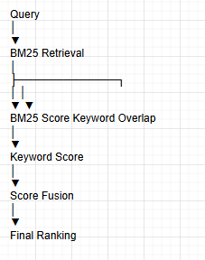
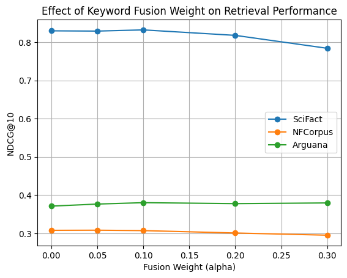
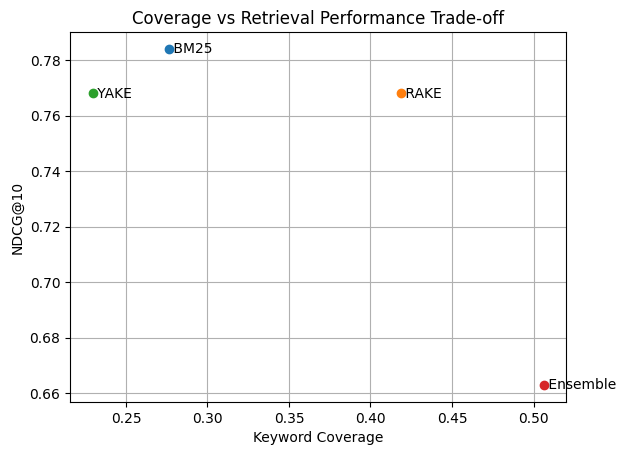

# Keyword Ensemble Metadata for Retrieval Preprocessing in RAG Systems

This repository contains research experiments investigating keyword-based document metadata for retrieval preprocessing in Retrieval-Augmented Generation (RAG) systems.

The goal of this project is to analyze whether simple keyword signals extracted from documents can be used as auxiliary retrieval signals when combined with traditional sparse retrieval models such as BM25.

Experiments are conducted using BEIR benchmark datasets and focus on analyzing the relationship between keyword coverage and retrieval ranking performance.

---

# Research Motivation

Retrieval-Augmented Generation (RAG) systems depend heavily on the quality of the retrieval stage.

However, many real-world document collections contain unstructured text where traditional sparse retrieval models may fail to capture semantic relevance.

Keyword-based document metadata provides a lightweight preprocessing method that can expand semantic coverage and help improve candidate document selection.

This research explores:

- Keyword ensemble-based document metadata generation
- Fusion retrieval using keyword overlap signals
- The relationship between keyword coverage and retrieval ranking performance

---

# Key Idea

Documents are processed using keyword extraction algorithms.

The extracted keywords are combined into a **keyword ensemble metadata set**, which is then used as an additional retrieval signal.

Retrieval scores are computed using a fusion strategy:

```
score = (1 - α) * BM25 + α * keyword_overlap
```

where

```
keyword_overlap = | query_tokens ∩ document_keywords |
```

This allows keyword metadata to function as a lightweight auxiliary signal in retrieval.



---

# Experiments

Experiments were conducted using the following **BEIR benchmark datasets**:

- SciFact
- NFCorpus
- Arguana

Configurations tested in the experiments include:

**Keyword extraction methods**

- RAKE
- YAKE
- Ensemble (RAKE + YAKE)

**Retrieval models**

- BM25 baseline
- BM25 + keyword fusion

**Evaluation metrics**

- NDCG@10
- MRR
- Recall@10

Additional experimental analysis includes:

- Alpha sweep experiments
- Keyword coverage analysis
- Coverage vs retrieval trade-off

---

# Results

## Alpha Sweep Analysis

The impact of fusion weight α on retrieval performance.



Small keyword weights (α ≈ 0.05 – 0.1) tend to provide the best balance between BM25 ranking and keyword signals.

---

## Coverage vs Retrieval Trade-off

Keyword ensemble significantly increases document keyword coverage, but higher coverage does not necessarily improve retrieval ranking performance.



This observation suggests that keyword metadata acts as a **weak auxiliary retrieval signal rather than a primary ranking signal.**

---

# Main Findings

Key observations from the experiments include:

- Keyword ensemble increases document keyword coverage
- Increased keyword coverage does not always improve retrieval ranking
- Keyword signals behave as auxiliary signals when fused with BM25

These results suggest that keyword-based metadata may be more useful for:

- candidate filtering
- document preprocessing
- retrieval signal augmentation in RAG pipelines

---

# Repository Structure

```
ai_orchestrator/
├── assets/                    # Figures and diagrams
│   ├── retrieval_pipeline.png
│   ├── alpha_sweep_ndcg.png
│   └── coverage_vs_ndcg_tradeoff.png
├── meta/
│   └── benchmark/             # BEIR benchmark experiments
│       ├── run_benchmark.py   # Main benchmark runner
│       ├── evaluate.py       # Evaluation logic
│       ├── retrievers.py     # BM25 + keyword fusion retrievers
│       ├── datasets.py       # BEIR dataset loading
│       ├── data/             # BEIR datasets (scifact, nfcorpus, arguana, ...)
│       └── results/          # Benchmark outputs (JSON, CSV, HTML)
├── run_benchmark.py          # Entry point (python run_benchmark.py)
└── README.md
```

## Quick Start

```bash
pip install rank-bm25 datasets beir rake-nltk yake
python run_benchmark.py
```

For presentation mode (SciFact, NFCorpus, Arguana):

```bash
python -m meta.benchmark.run_benchmark --presentation --force-reset
```

For alpha sweep fusion experiment:

```bash
python -m meta.benchmark.run_benchmark --alpha-sweep-fusion
```
